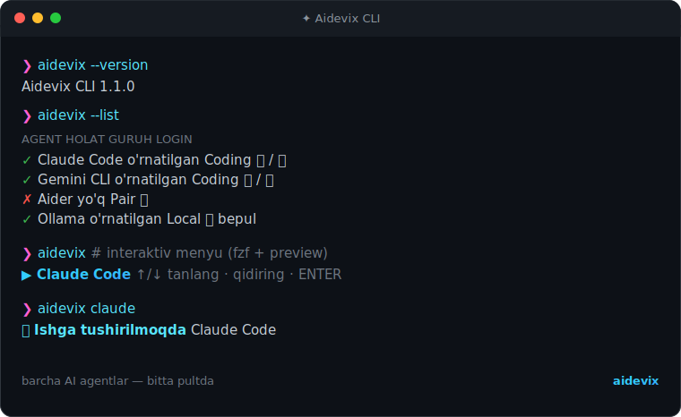

<div align="center">


# ✦ Aidevix CLI

### *One command. 28 top AI CLIs. Endless possibilities.*

Type `aidevix` → pick from the list → the CLI launches automatically.
Not installed yet? It installs itself. 🪄

[🇺🇿 O'zbekcha](./README.md) · **🇬🇧 English**

[](https://github.com/SUNNATBEE/sunnatbeeCLI/releases/latest)
[](https://github.com/SUNNATBEE/sunnatbeeCLI/actions/workflows/ci.yml)
[](#)
[](https://github.com/junegunn/fzf)
[](./LICENSE)

[](#-installation)
[](./CONTRIBUTING.md)
[](https://www.conventionalcommits.org/)
[](https://github.com/SUNNATBEE/sunnatbeeCLI/stargazers)

<br/>



<sub>▶ Generate the animated demo: <code>bash scripts/record-demo.sh</code> → <code>assets/demo.gif</code></sub>

</div>

> **⚡ Quick install** — in Git Bash (Windows) or a terminal (Linux/macOS):
>
> ```bash
> curl -fsSL https://raw.githubusercontent.com/SUNNATBEE/sunnatbeeCLI/main/bootstrap.sh | bash
> ```
>
> Then `source ~/.bashrc && aidevix`. Full guide: [**Installation**](#-installation) · Downloads: [**Releases**](https://github.com/SUNNATBEE/sunnatbeeCLI/releases/latest)

---

## 📖 About

**Aidevix CLI** is a single-command launcher for 28 top terminal AI CLI agents
(Claude Code, Codex, Gemini, Copilot, Aider, Ollama and more) through one
interactive menu. Works in `bash`, `zsh`, `cmd` and `PowerShell`.

> 🎓 Built especially for **beginners**: install with a single command and start
> using any AI CLI right away — no need to memorize which package installs with
> which command.

---

## ✨ Features

| | Feature | Description |
|---|---|---|
| 🎨 | **Polished design** | AD logo + gradient banner, live **spinner** animation, colored preview — clean and modern |
| ⚡ | **One-command install** | `curl ... \| bash` — the rest is automatic |
| 🎛️ | **A single `aidevix` menu** | 28 top AI CLIs in one interactive list (status + preview) |
| 🪄 | **Auto-install** | If the chosen CLI is missing, it asks for permission and installs it |
| 🔐 | **Login guidance** | Shows which login/API key each agent needs; keys are never stored |
| 🚀 | **Quick launch** | `aidevix claude` — straight to the agent, no menu |
| 🕘 | **Remembers last choice** | The most recently used agent appears at the top |
| 🪄 | **fzf installs itself** | Downloads fzf during install (no sudo); falls back to a numeric menu |
| 🔄 | **Auto-update** | When the project updates, `aidevix` quietly updates itself and shows what changed |
| ♻️ | **`aidevix --update`** | Updates all installed agents with one command |
| 🩺 | **`aidevix --doctor`** | Checks your environment (node/npm/python/fzf, PATH) |
| ➕ | **`aidevix --add`** | Adds a new agent interactively (no manual file editing) |
| 🧭 | **Automatic PATH fixing** | Finds npm/pip global bin dirs — works on a fresh machine |
| 🩺 | **Friendly error messages** | On failure it explains the cause and fix in **plain language** |
| ⌨️ | **Shell completion** | `aidevix <TAB>` completes agent names (bash/zsh/fish) |
| 🪟 | **Windows wrappers** | `aidevix.cmd` / `aidevix.ps1` — also works from PowerShell/cmd |
| 🔌 | **Extensible** | Add a new agent with a single line — no code |
| 🛡️ | **Safe** | `.bashrc`/`.zshrc` is **backed up** before any change |
| 🧹 | **Clean uninstall** | `uninstall.sh` reverts everything cleanly |

---

## 🤖 Supported AI CLI agents

| # | Agent | Command | Group | Login |
|---|---|---|---|---|
| 1 | 🧠 Claude Code | `claude` | Coding | 🔑 / 💳 |
| 2 | ⚡ OpenAI Codex | `codex` | Coding | 🌐 / 🔑 |
| 3 | ✨ Gemini CLI | `gemini` | Coding | 🌐 / 🔑 |
| 4 | 🐙 GitHub Copilot | `copilot` | Coding | 💳 |
| 5 | 🟢 OpenCode | `opencode` | Coding | 🔑 |
| 6 | 💅 Crush | `crush` | Coding | 🔑 |
| 7 | 🐉 Qwen Code | `qwen` | Coding | 🌐 / 🔑 |
| 8 | 🔁 Continue | `cn` | Coding | 🌐 / 🔑 |
| 9 | 🎯 Cursor Agent | `cursor-agent` | Coding | 🌐 |
| 10 | 🗺️ Plandex | `plandex` | Coding | 🌐 / 🔑 |
| 11 | 🤝 Aider | `aider` | Pair | 🔑 |
| 12 | 🦢 Goose | `goose` | Agent | 🔑 |
| 13 | 🦙 Ollama | `ollama` | Local | 🆓 |
| 14 | 💬 llm | `llm` | Chat | 🔑 |
| 15 | 🗨️ AIChat | `aichat` | Chat | 🔑 |
| 16 | 💻 Open Interpreter | `interpreter` | Agent | 🆓 **free** |
| 17 | 🙌 OpenHands | `openhands` | Agent | 🆓 **free** |
| 18 | 🛠️ SWE-agent | `sweagent` | Agent | 🆓 **free** |
| 19 | 🧩 Cline CLI | `cline` | Coding | 🆓 **free** |
| 20 | 🦘 Kilo CLI | `kilo` | Coding | 🆓 **free** |
| 21 | 🤖 Grok Build | `grok` | Coding | 💳 / 🌐 |
| 22 | 🚀 Antigravity | `antigravity` | Coding | 🆓 **free** |
| 23 | 🐙 GitHub CLI | `gh` | Tools | 🆓 **free** |
| 24 | 🛡️ Freebuff | `freebuff` | Coding | 🌐 |
| 25 | 🐝 Codebuff | `codebuff` | Coding | 🆓 / 🔑 / 💳 |
| 26 | 🧰 gptme | `gptme` | Agent | 🆓 **free** |
| 27 | 💬 Shell GPT | `sgpt` | Chat | 🔑 |
| 28 | 🪄 Mods | `mods` | Chat | 🔑 |

> **Login icons:** 🔑 API key · 🌐 browser login · 💳 subscription · 🆓 **free** (open source / free tier).
> 💡 **`aidevix --free`** shows only free agents (11+).
> The list lives in `config/agents.conf` — edit/add as you like.
> ⚠️ Cursor Agent does not work on Windows yet; Antigravity is a manually-downloaded
> IDE; GitHub CLI on Windows can also be installed via `winget install GitHub.cli`.

---

## 🚀 Installation

Installation takes just **a few minutes**. Follow the 3 steps below in order.

### 1️⃣ Prerequisites

Before installing, make sure you have:

| Tool | Required? | Why | How to install |
|---|:---:|---|---|
| **git** | ✅ Yes | To download the project | [git-scm.com/downloads](https://git-scm.com/downloads) |
| **curl** or **wget** | ✅ Yes | To download the installer | Usually present on macOS/Linux; ships with Git Bash on Windows |
| **fzf** | 🪄 Automatic | Pretty searchable menu | The installer **downloads it for you** (no sudo) |
| **Node.js / Python** | ❌ No | Only for the chosen AI CLI | `aidevix` offers what's needed |

> 🪟 **Windows users!** This tool runs inside **Git Bash**. First install
> [**Git for Windows**](https://git-scm.com/download/win) (Next → Next → Finish),
> then open **"Git Bash"** and run the commands **in that window** — not in plain
> `cmd` or PowerShell.

### 2️⃣ Pick the command for your terminal

#### 🐧 Linux / 🍎 macOS — `bash` or `zsh`

```bash
curl -fsSL https://raw.githubusercontent.com/SUNNATBEE/sunnatbeeCLI/main/bootstrap.sh | bash
```

<sub>No `curl`? Use `wget`:</sub>

```bash
wget -qO- https://raw.githubusercontent.com/SUNNATBEE/sunnatbeeCLI/main/bootstrap.sh | bash
```

#### 🪟 Windows — Git Bash

Open **"Git Bash"** from the Start menu (NOT `cmd`/PowerShell) and run the same command:

```bash
curl -fsSL https://raw.githubusercontent.com/SUNNATBEE/sunnatbeeCLI/main/bootstrap.sh | bash
```

> ❓ **"bash" not found?** You're in `cmd` or PowerShell. Close them and open
> **Git Bash** — the command works there.

> ⚠️ **`curl: (35) ... CRYPT_E_NO_REVOCATION_CHECK`?** This happens when curl on
> Windows can't reach the certificate-revocation server (a network issue, not
> yours). Fix: add `--ssl-no-revoke`:
>
> ```bash
> curl --ssl-no-revoke -fsSL https://raw.githubusercontent.com/SUNNATBEE/sunnatbeeCLI/main/bootstrap.sh | bash
> ```

#### 📦 Via package managers

```bash
# npm (cross-platform — requires Node.js, and bash for the runtime)
npm install -g aidevix

# Homebrew (macOS / Linux)
brew install SUNNATBEE/tap/aidevix

# Scoop (Windows)
scoop bucket add aidevix https://github.com/SUNNATBEE/sunnatbeeCLI
scoop install aidevix
```

> See [`packaging/`](./packaging) for the Homebrew formula and Scoop manifest.

---

The one-liner above does everything **automatically**:

1. 📥 Clones the project into `~/.ai-cli`
2. 🔍 Checks prerequisites and **installs `fzf` automatically**
3. 💾 **Backs up** `~/.bashrc` / `~/.zshrc`
4. 🔗 Installs the `aidevix` command (+ `aidevix.cmd` / `aidevix.ps1` on Windows)
5. ⚙️ Copies the agent list into `~/.config/ai-cli/`
6. ⌨️ Sets up `PATH` and shell completion

<details>
<summary><b>🛠️ Option B — Manual install (with git clone)</b></summary>

```bash
git clone https://github.com/SUNNATBEE/sunnatbeeCLI.git ~/.ai-cli
bash ~/.ai-cli/install.sh
```

</details>

### 3️⃣ Reopen your terminal and verify

After install, **close and reopen the terminal** (or `source ~/.bashrc`). Then:

```bash
aidevix --doctor     # checks that the environment is set up correctly
aidevix              # opens the menu 🎉
```

✅ Menu opened? Congratulations — you're ready!

> 🩺 **Hit a problem?** Run **`aidevix --doctor`** first — it finds the issue and
> tells you what to do in plain language. Full guide:
> [**TROUBLESHOOTING.md**](./TROUBLESHOOTING.md).

---

## 🎮 Usage

```bash
aidevix
```

Type to search → pick with `↑/↓` → press `ENTER`. On the right, the selected
agent's details (status, command, install method) appear live.

> 💡 No `fzf`? The same thing shows as a simple **numeric menu** — nothing is lost.

### Commands

| Command | What it does |
|---|---|
| `aidevix` | Opens the interactive menu (fzf + preview, or numeric) |
| `aidevix <agent>` | Launches an agent **directly** by name/binary (e.g. `aidevix claude`) |
| `aidevix --list` | Lists all CLIs and their **installed / missing** status |
| `aidevix --free` | 🆓 **Free-only** agent menu (best for trying things out) |
| `aidevix --top` | ⭐ **Most popular** agents menu |
| `aidevix --update` | Updates all installed agents |
| `aidevix --doctor` | Checks the environment (tools, PATH, agent status) |
| `aidevix --add` | Adds a new agent interactively |
| `aidevix --version` | Shows the Aidevix CLI version |
| `aidevix --help` | Prints help |

> 💡 `aidevix <TAB>` completes agent names (after install).

---

## 🔐 Login / API keys

Most AI CLIs require **login** or an **API key** before they work. Aidevix makes
this simpler:

- 📋 Each agent shows an icon (🆓/🔑/🌐/💳); the preview shows the full login
  requirement and a **link**.
- 🌐 The login page opens in the browser **only when necessary** — i.e. when the
  agent requires you to supply an API key **and** that key isn't set yet. If the
  agent logs in itself (browser login), is subscription-based or free, **or the
  key already exists**, no browser opens — just a short note.
- 🔒 You enter keys yourself, following the agent's own instructions. **Aidevix
  never sees or stores any password or key** — they stay on your computer.

| Icon | Meaning | Example |
|:---:|---|---|
| 🔑 | **API key** required | `ANTHROPIC_API_KEY`, `OPENAI_API_KEY`, OpenRouter |
| 🌐 | **Browser login** | Google / ChatGPT / Cursor account |
| 💳 | **Subscription** required | GitHub Copilot, Claude Pro/Max |
| 🆓 | **Free** — no login | Ollama (local models) |

---

## ➕ Adding your own agents

The best part — **no coding required**. Agents live in a plain text file:

```bash
~/.config/ai-cli/agents.conf
```

Easiest way — the interactive adder:

```bash
aidevix --add
```

Or by hand — each agent is **one line**, fields separated by `|`:

```text
NAME | BINARY | COMMAND | INSTALL | DESCRIPTION | CATEGORY | AUTH | URL
```

| Field | Meaning |
|---|---|
| **NAME** | Name shown in the menu |
| **BINARY** | Executable checked on PATH (`command -v`) |
| **COMMAND** | Command to run (with arguments) |
| **INSTALL** | Install command used when the CLI is missing |
| **DESCRIPTION** | Short description |
| **CATEGORY** | *(optional)* Group: `Coding`, `Chat`, `Local`, etc. |
| **AUTH** | *(optional)* Login/key hint (🆓/🔑/🌐/💳) |
| **URL** | *(optional)* Login/docs link |

> 💡 **Note:** don't use `|` inside the `INSTALL` field — it's the separator. Use
> `bash -c "$(curl -fsSL https://example.com/install.sh)"` instead of `curl ... | bash`.

> 🔧 **Environment variables:**
> | Variable | Purpose |
> |---|---|
> | `AI_PULT_CONFIG` | Point to a different config file |
> | `AI_NO_ANIM=1` | Disable animations (spinner/banner) |
> | `NO_COLOR=1` | Disable colors entirely |
> | `AIDEVIX_NO_AUTOUPDATE=1` | Disable auto-update |
> | `AIDEVIX_UPDATE_INTERVAL` | Update-check interval (seconds, default 10800 = 3h) |

---

## 🔄 Auto-update

`aidevix` **keeps itself up to date** — nothing to do by hand. When a new feature
or agent is added (pushed to `main`), the next time `aidevix` runs it quietly
pulls the change and shows what was updated.

- 🔒 **Safe:** your local changes are never overwritten.
- ⏱️ **Efficient:** checks once every 3 hours (configurable).
- ⛔ Disable: `export AIDEVIX_NO_AUTOUPDATE=1`.

---

## 🧪 Tests

```bash
make test     # or: bats tests/
make check    # syntax + lint + test (same as CI)
```

Details: [`tests/README.md`](./tests/README.md). CI runs them on every push/PR.

---

## 🔐 Security

Aidevix runs third-party installers (`npm`, `pip`, `curl | bash`) **with your
permission** and never **sees or stores** your API keys. Full security model and
how to report a vulnerability: [**SECURITY.md**](./SECURITY.md).

---

## 🗑️ Uninstall

```bash
bash ~/.ai-cli/uninstall.sh
```

This removes the `.bashrc`/`.zshrc` block (with a backup) and the `aidevix`
command. Remove the config yourself if you like:

```bash
rm -rf ~/.config/ai-cli ~/.ai-cli
```

---

## 🤝 Contributing

PRs welcome! Full guide: [**CONTRIBUTING.md**](./CONTRIBUTING.md).

In short: Fork → branch → commit ([Conventional Commits](https://www.conventionalcommits.org/))
→ Pull Request. Adding a new AI CLI is the easiest contribution — one line in
`config/agents.conf`. Run [shellcheck](https://www.shellcheck.net/) and
`bats tests/` before pushing (CI checks both). 🙏

Contributors follow the [Code of Conduct](./CODE_OF_CONDUCT.md).

---

## 📜 License

[MIT](./LICENSE) — use, modify and distribute freely.

<div align="center">

**⭐ If this is useful, star the repo!**

</div>
